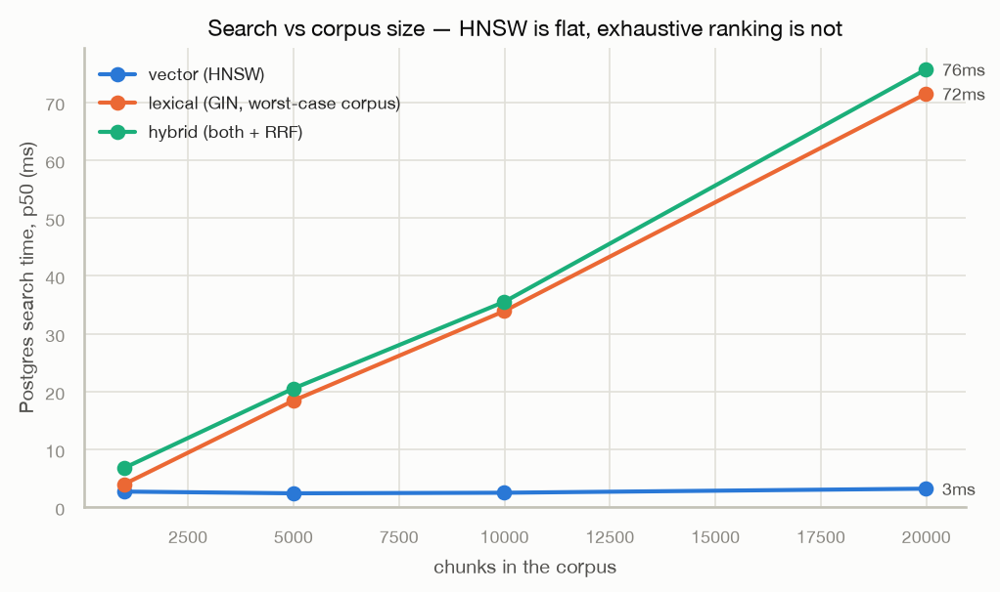
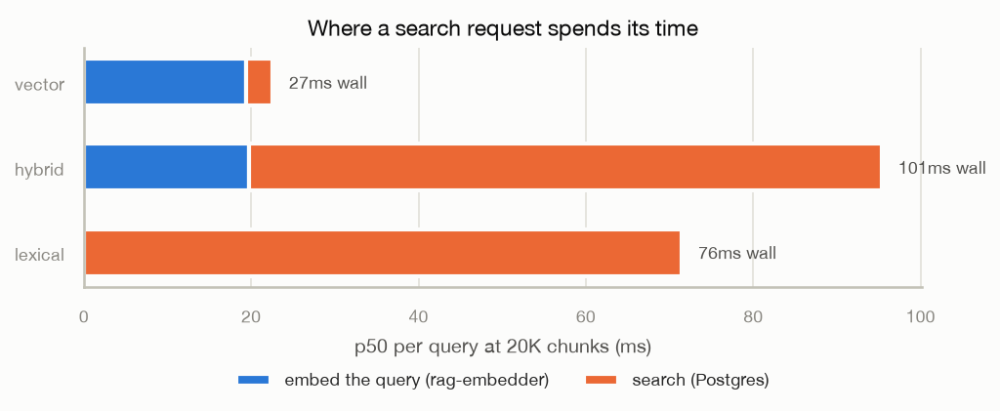
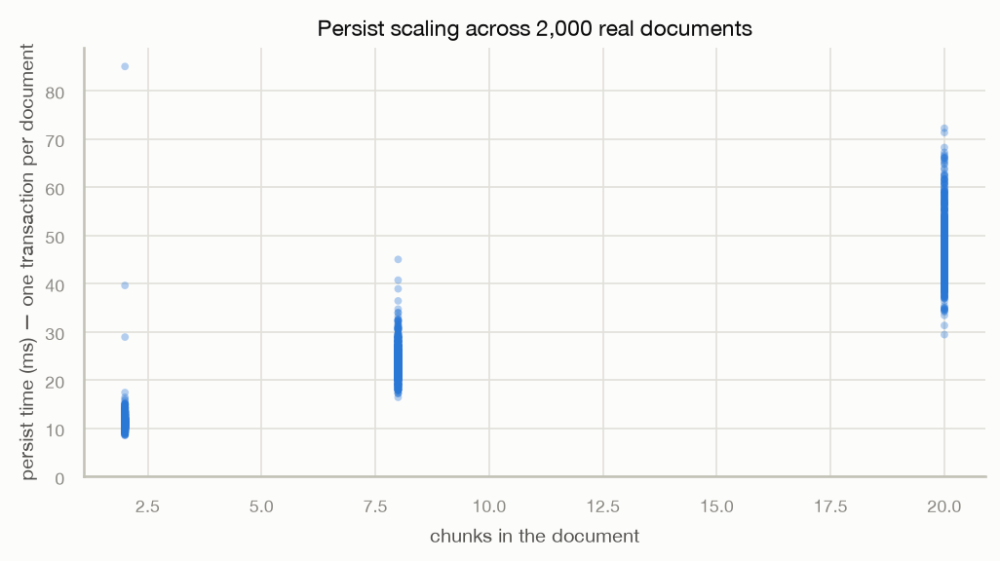
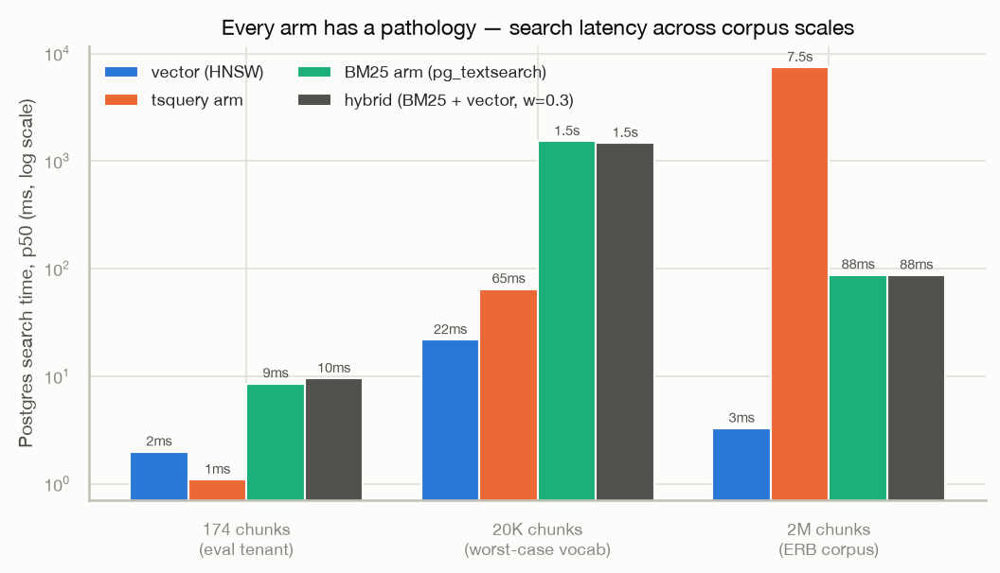

# Session 3.2 — persist and search, measured

2026-08-02. 2,000 synthetic documents (mixed sizes: 1/4/10 sections) seeded
through the REAL pipeline — rag-ingest → rag-embedder → rag-api → Postgres —
from an in-cluster client, pausing at corpus checkpoints to measure search.
19,990 chunks in 1,108s end-to-end (~18 chunks/s including persistence,
consistent with the embedder-bound token rate from part 2).

## Search vs corpus size

| corpus | vector (db) | lexical (db) | hybrid (db) | embed query |
|---|---|---|---|---|
| 1K chunks | 2.7ms | 4.0ms | 6.8ms | ~18ms |
| 5K | 2.4ms | 18.4ms | 20.5ms | ~17ms |
| 10K | 2.5ms | 33.9ms | 35.5ms | ~18ms |
| 20K | **3.2ms** | 71.5ms | 75.7ms | ~20ms |

1. **HNSW is flat**: 2.7 → 3.2ms across a 20× corpus growth. That is the
   entire argument for approximate nearest-neighbor indexes, measured.
2. **The lexical line is a worst-case artifact — and a real lesson.** The
   synthetic corpus recycles 20 words, so every query term matches nearly
   every chunk and `ts_rank_cd` must score the whole table: cost scales
   with MATCHING rows, not corpus size. Real vocabularies are selective;
   real lexical cost sits far below this line. The lesson stands though:
   the GIN index finds candidates fast, but ranking them is linear in how
   many there are.
3. **The embedder dominates the vector path** (~18ms of a ~27ms wall). The
   fastest thing in this platform is now a Postgres ANN query.

## Persist scaling

Linear in chunk count at ~2.5ms/chunk plus ~7ms base: 2-chunk docs ~12ms,
8-chunk ~25ms, 20-chunk ~50ms. One transaction per document throughout;
19,990 chunks persisted with zero errors.

## The batch-token-budget fix (embedder memory)

Follow-up to the 1.6GiB serving-pod observation: ORT's arena grows to the
largest batch seen and never shrinks, and ingest sends batches of 32 ×
~480-token chunks — ~6× the token load the batch-32 knee was measured on
(40-token texts).

Measured on the embed node, fresh arena per batch size, 480-token texts:

| batch | throughput | peak RSS |
|---|---|---|
| 4 | 12.5 texts/s (6.0k tok/s) | 710MB |
| 8 | 11.9 texts/s (5.7k tok/s) | 947MB |
| 16, 32 | runs failed (likely node memory pressure beside the 1.6GB serving pod) | — |

**Batch 4 already saturates** — tokens/s is the invariant and 4 × 480
tokens reaches it. Batches beyond ~8 buy zero throughput and hundreds of MB
of permanent arena. "Batch size is a token budget, not a count."

**Applied and confirmed in production**: `EMBED_BATCH_SIZE=8` on rag-ingest
plus an embedder restart. Two heavy 80-chunk documents later, the serving
pod's RSS plateaus at **811Mi** (stable: 810 → 811 across runs) versus
1.6GB+ before, at identical throughput (~19.5 chunks/s both ways). Half the
memory for one env var.

## Revisited after session 3.5 — every arm at real scales

The platform's lexical arm is now BM25 (`pg_textsearch`, see
`benchmarks-3.5.md`). Re-measured on the live cluster with all tenants
in place (2026-08-03), p50 of the Postgres stage:

| corpus (tenant) | vector | tsquery arm | BM25 arm | hybrid (BM25, w=0.3) |
|---|---|---|---|---|
| 174 chunks (eval) | 2.0ms | 1.1ms | 8.6ms | 9.6ms |
| 20K chunks (worst-case vocab) | 21.9ms | 65ms | **1.53s** | 1.48s |
| 2M chunks (ERB) | 3.3ms | **7.46s** | 88ms | 88ms |

Three lessons, one per column:

1. **tsquery ranking is linear in matches** — fine until the corpus is
   big (7.5s at 2M chunks). The original worst-case-corpus lesson, now
   fatal at scale.
2. **BM25's Block-Max WAND prunes by score gaps.** On real vocabulary it
   is nearly scale-free (88ms at 2M). On the synthetic worst-case corpus
   — twenty words recycled everywhere, all postings scoring alike —
   there is nothing to prune AND the index is table-wide while the
   tenant is 1% of it, so the scan streams deep past other tenants' rows
   before RLS lets 50 through: 1.5s. Every ranking strategy has a corpus
   that defeats it; this one's is "no term is rarer than any other."
3. The multi-tenant caveat generalizes: the bm25 index (like HNSW) is
   global, tenant filtering is post-hoc, so small tenants pay when their
   query terms are corpus-common. Watch this if tenants diverge wildly
   in size; a per-tenant partial index is the escape hatch if it bites.
