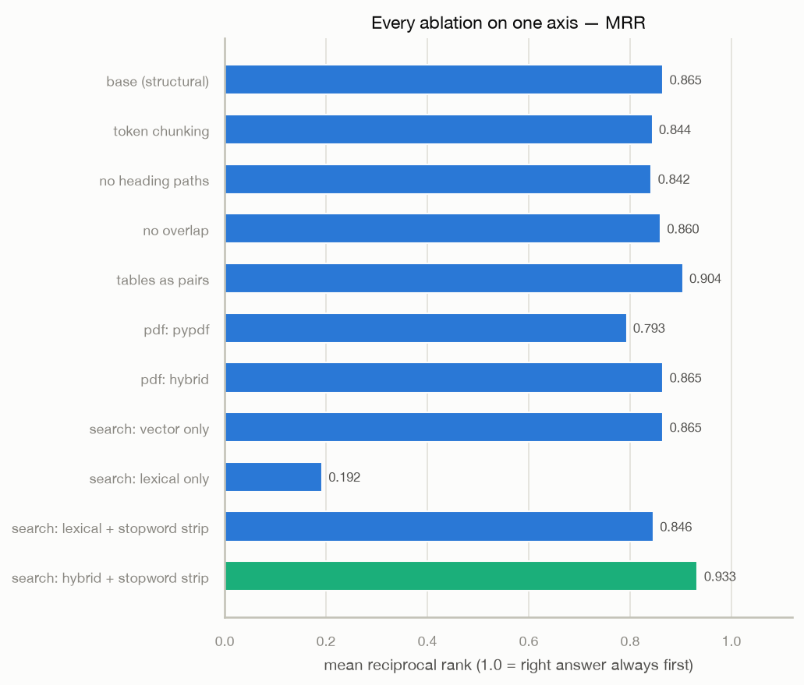
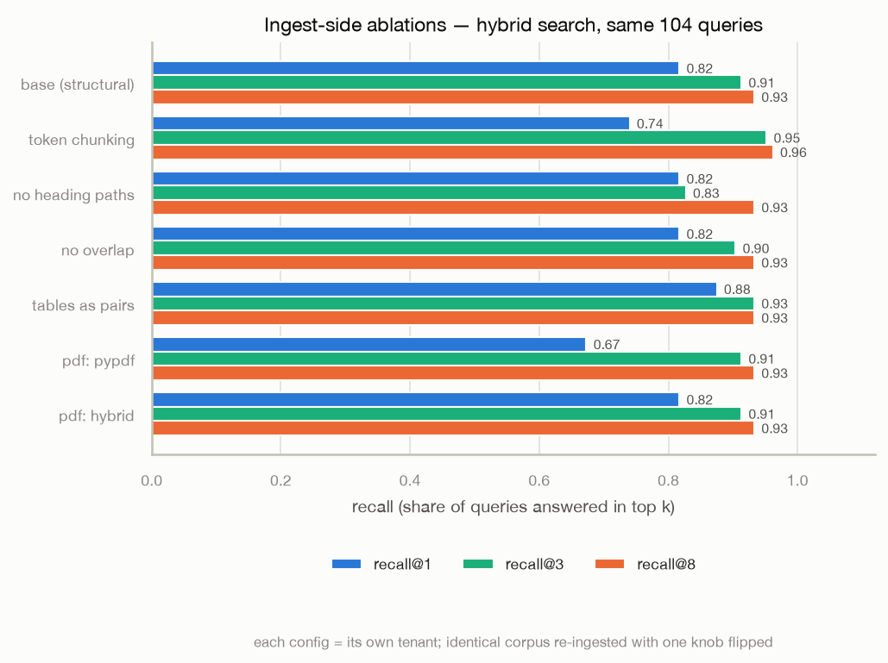
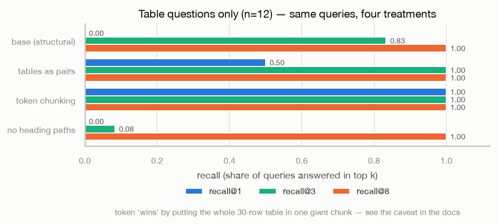
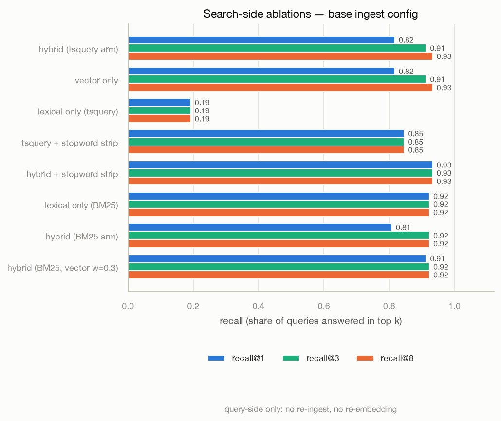
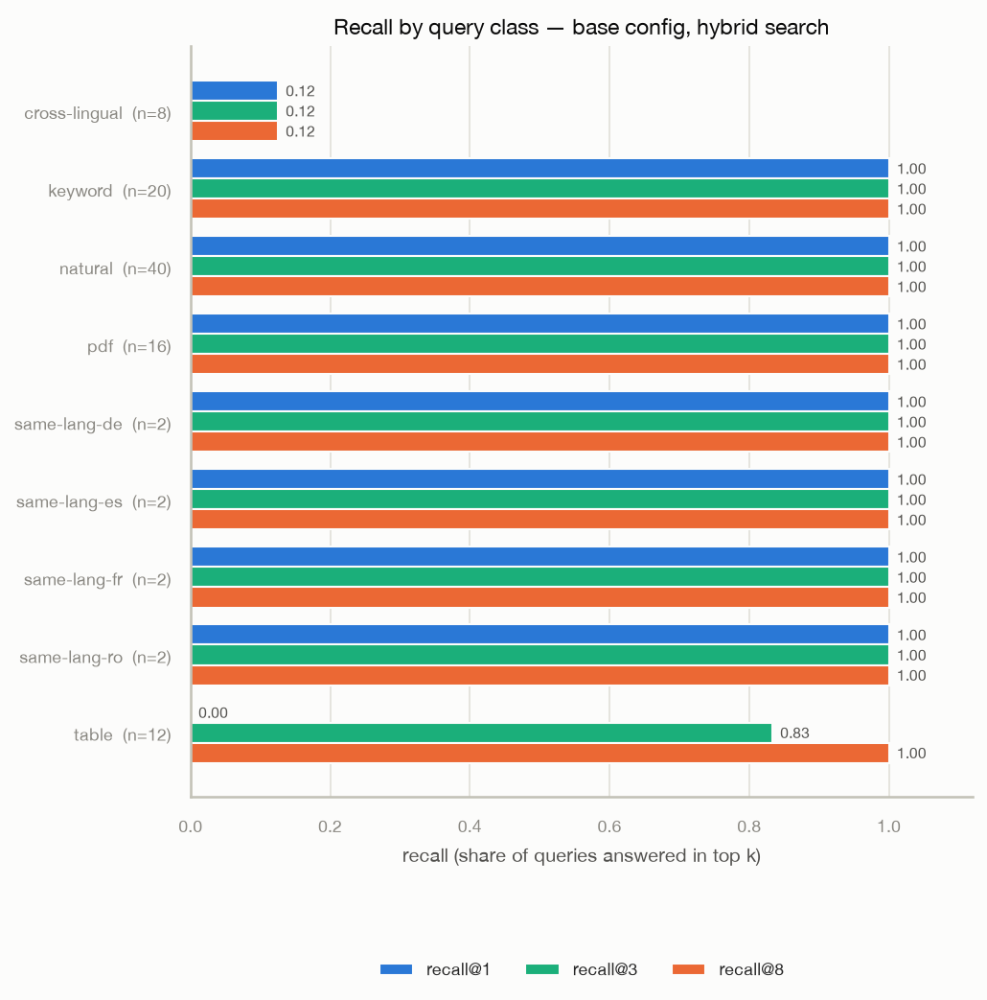

# Session 3.3 — the eval harness: six questions, answered

2026-08-02. 42-document corpus with **planted markers** (unique tokens like
`qzmd4x1v` inside facts), 104 queries across six classes, run against the
LIVE cluster — every ingest goes through rag-ingest → rag-embedder →
rag-api → Postgres, exactly like production traffic. A query is answered
correctly if a returned chunk contains its marker; markers make ground
truth configuration-agnostic, because however the document was chunked, the
marker is in exactly one place.

**Tenant-per-ablation**: each ingest-side configuration gets its own tenant
and the same corpus is re-ingested with one knob flipped. RLS — the same
mechanism that isolates customers — isolates the ablations. Search-side
ablations (mode, stopword strip) reuse the base tenant: no re-ingest.

Corpus: 20 markdown manuals (6 sections each), 6 documents with 30-row
tables, 8 multilingual docs (de/fr/ro/es), 8 PDFs with font-size headings.
Query classes: natural (n=40), keyword (20), table (12), pdf (16),
same-language ×4 (8), cross-lingual (8). Ingest of the full corpus takes
~30s per configuration; the whole 7-config × 42-doc, 12-pass × 104-query
run finishes in about six minutes.

Metrics: recall@k = share of queries whose marker chunk appears in the top
k; MRR = mean of 1/rank of the first correct chunk (1.0 = always first).

## Everything on one axis



| configuration | chunks | r@1 | r@3 | r@8 | MRR |
|---|---|---|---|---|---|
| base (structural, pypdfium2, grid) | 174 | 0.82 | 0.91 | 0.93 | 0.865 |
| token chunking | 68 | 0.74 | 0.95 | 0.96 | 0.844 |
| no heading paths | 174 | 0.82 | 0.83 | 0.93 | 0.842 |
| no overlap | 174 | 0.82 | 0.90 | 0.93 | 0.860 |
| tables as pairs | 172 | 0.88 | 0.93 | 0.93 | **0.904** |
| pdf: pypdf | 150 | 0.67 | 0.91 | 0.93 | 0.793 |
| pdf: hybrid router | 174 | 0.82 | 0.91 | 0.93 | 0.865 |
| search: vector only | — | 0.82 | 0.91 | 0.93 | 0.865 |
| search: lexical only | — | 0.19 | 0.19 | 0.19 | 0.192 |
| search: lexical + strip | — | 0.85 | 0.85 | 0.85 | 0.846 |
| search: hybrid + strip | — | **0.93** | **0.93** | 0.93 | **0.933** |



## The six registered questions

### 1. Structural vs token chunking

Token wins recall@3 (0.95 vs 0.91) and loses MRR (0.844 vs 0.865) — and
the "win" is an artifact worth understanding. Token chunking packs the
corpus into 68 chunks instead of 174; each chunk is ~3× bigger, so the
whole 30-row table lands in ONE chunk and every table query trivially
finds it (table class: r@1 1.00). But recall-of-a-marker is not answer
quality: retrieving a 480-token blob that contains the answer somewhere
costs 3× the context budget of retrieving the right 150-token section,
and at k=8 the token config returns ~12% of its entire corpus per query.
The eval measures "is the fact in what we hand the LLM"; the structural
config hands a third of the tokens for nearly the same recall and better
ranking. Verdict: **structural**, with eyes open about what the metric
does and does not say.

### 2. Heading paths: the single most load-bearing ingest knob

Dropping the heading-path prefix costs recall@3 0.91 → 0.83 overall — and
the damage concentrates exactly where structure is the only signal:



Table queries collapse from r@3 0.83 to **0.08** without heading paths. A
chunk of `| dept-velvet-21 | qztb1x21v | 68 |` rows has almost no semantic
surface for "q3 churn rate" — the prepended `crimson churn report >
Quarterly figures` line is what the embedder actually matches. Verdict:
**keep heading paths on, always**.

### 3. Overlap

0.91 → 0.90 recall@3 without overlap: one query. The planted facts are
single sentences that rarely straddle a boundary, which is precisely the
population overlap protects — this corpus under-exercises it. It costs
~6% extra tokens and protects against a real failure mode the eval can
barely see. Verdict: **keep it, cheap insurance**.

### 4. PDF engine choice

pypdf and pypdfium2 both find the facts eventually (r@3 0.91 both), but
pypdf's flat text extraction loses the font-size headings → no heading
paths on PDF chunks → the pdf query class drops from **MRR 1.000 to
0.531** (r@1 1.00 → 0.06). Same mechanism as question 2, measured from a
different direction. The hybrid router scores identically to pypdfium2 on
this corpus — all 8 PDFs are prose, the path-count detector routes them
to pypdfium2, and the tables-only pdfplumber pass never fires. Verdict:
**pypdfium2 via the hybrid router**, and the 2.1 shootout's structural
argument now has a retrieval-quality number attached.

### 5. Tables: grid vs pairs

Grid NEVER puts the right chunk first (table class r@1 0.00, MRR 0.413);
pairs reaches r@1 0.50, r@3 1.00, MRR 0.750 — and wins overall MRR 0.904,
the best ingest-side config. Row-as-sentence ("department: dept-velvet-21.
q3 churn rate: qztb1x21v.") gives the embedder prose to work with where a
pipe-delimited grid gives it soup. Verdict: **pairs for retrieval**; grid
remains the right default when chunks are rendered back to humans or the
LLM needs whole-table context — this is a per-corpus knob, now with its
price measured from both sides (2.2 measured pairs' token cost, 3.3 its
retrieval win).

### 6. Query-side stopword stripping



The 3.2 finding, now quantified: `websearch_to_tsquery('simple', …)` ANDs
every term and the 'simple' config keeps stopwords, so natural-language
questions demand "what"/"is"/"the" appear in the chunk. Lexical-only
recall on natural questions: **0.00**. Strip stopwords from the query
(never the index) and lexical recall goes 0.19 → 0.85 overall — and
hybrid+strip becomes the best configuration in the whole eval: **MRR
0.933**, r@1 0.93. The lexical arm stops being dead weight on natural
questions while keeping its exact-match power (keyword class was already
1.00). Verdict at the time: **turn `lexical_stopword_strip` on by
default**.

**Superseded by the BM25 arm (session 3.5, re-measured on the same
tenants):** with `lexical_backend=bm25` the strip hack is obsolete —
BM25's IDF makes stopwords cheap instead of mandatory. Lexical-only
recall@3 without any stripping: **0.923** (vs 0.19 raw tsquery, 0.85
stripped); hybrid-BM25 with vector weight 0.3: MRR 0.918, statistically
tied with the tuned tsquery champion (0.933 ≈ one query of difference)
on this small corpus. The gap explodes at scale — see
`benchmarks-3.5.md` (0.66 vs 0.22 on 512K docs) and the per-tenant
latency caveat in `benchmarks-3.2.md`.

## What the harness caught that we didn't plant



**Cross-lingual retrieval mostly fails on e5-small.** Same-language
retrieval is perfect in all four languages (8/8 — German questions find
German chunks). But English questions against non-English documents: 1/8,
in every configuration. The one hit is Spanish "el inventario anual" ↔
"the annual inventory" — a cognate, not cross-lingual understanding.
"Multilingual model" means each language is embedded well, not that the
languages share a semantic space tightly enough for 384-dim retrieval.
If cross-lingual matters, translate at ingest or query time — don't
expect the embedder to do it.

English fact-lookup saturates (natural/keyword/pdf all 1.00 on base) —
by design: markers verify the pipeline delivers, while tables,
cross-lingual, and the ablations do the discriminating.

## Honest limits

- 174 chunks is retrieval-easy; ranking effects (grid vs pairs, heading
  paths) transfer to scale, absolute recall numbers do not.
- Marker-in-chunk is retrieval ground truth, not answer quality — no LLM
  in the loop. That's 3.4's job (EnterpriseRAG-Bench).
- One corpus, synthetic, English-question-biased. The per-class table is
  the honest view; the headline number flatters.

Reproduce:

```bash
uv run --with fpdf2 python eval/build_corpus.py --out eval/corpus
uv run python eval/run_eval.py \
    --ingest-url https://rag-ingest.<tailnet>.ts.net \
    --api-url https://rag-api.<tailnet>.ts.net \
    --json results/eval-amd-v1.json
uv run --with matplotlib --with seaborn python eval/plot_eval.py \
    results/eval-amd-v1.json --out docs/figures
```
