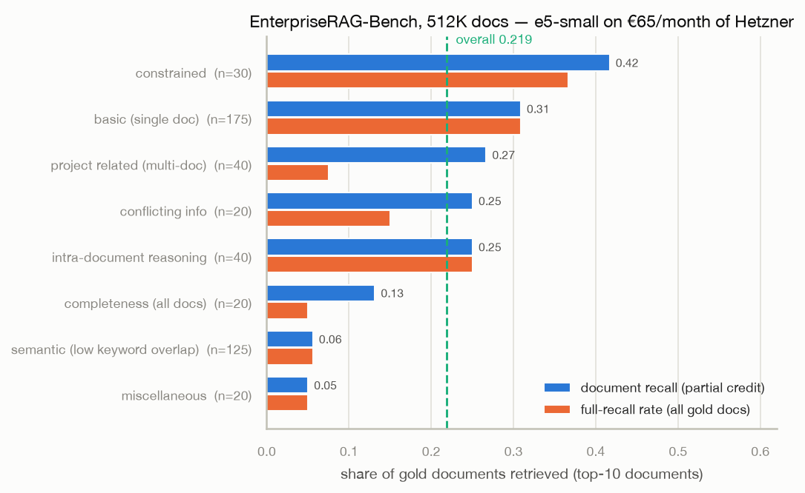
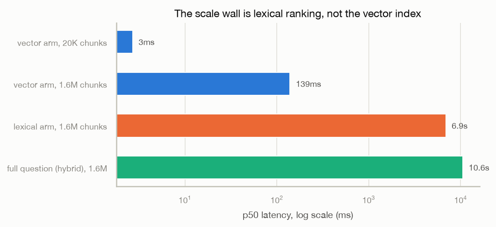

# Session 3.4 — EnterpriseRAG-Bench: the capstone, scored

2026-08-03. The full benchmark corpus — 511,962 documents (~2.5GB text,
590M+ tokens, 1.59M chunks) from 9 simulated enterprise platforms —
ingested through the LIVE pipeline (rag-ingest → rag-embedder → rag-api →
Postgres) into one tenant, then all 500 questions asked at the
eval-chosen configuration (structural chunking + heading paths + overlap
+ hybrid PDF routing + pairs tables + hybrid search with query-side
stopword strip; top-40 chunks → top-10 documents).

Pre-registered prediction (written before the score, see
article-part3-notes.md §11): document recall 0.5–0.7. **Wrong.**

## The score

**Document Recall 0.219** (partial credit), full-recall rate 0.192, over
the 470 questions that have gold documents.



| question type | n | recall | full recall |
|---|---|---|---|
| constrained | 30 | 0.417 | 0.367 |
| basic (single doc) | 175 | 0.309 | 0.309 |
| project related | 40 | 0.267 | 0.075 |
| conflicting info | 20 | 0.250 | 0.150 |
| intra-document reasoning | 40 | 0.250 | 0.250 |
| completeness | 20 | 0.131 | 0.050 |
| **semantic** | **125** | **0.056** | 0.056 |
| miscellaneous | 20 | 0.050 | 0.050 |

## Why — diagnosed, not guessed

Sanity first: the pipeline works. A failed basic question's gold document
is present (4 chunks), and an exact-phrase lexical query
("timebox-triggered finalizations") returns it at **rank 1**. Ingestion,
indexing, RLS, retrieval — all functioning. The misses are the model and
the query semantics, and each arm fails in its own way:

1. **The vector arm at 384 dimensions is crowded.** For that same failed
   question, the gold chunk's exact vector rank is **15,698 of 1.59M** —
   top 1% of the corpus by similarity, nowhere near top-40. Raising
   `hnsw.ef_search` from 40 to 400 does not surface it (verified
   directly): this is not an ANN-recall tuning problem, the embedding
   geometry simply does not put "metric for tracking finalized streaming
   sessions" near "timebox-triggered finalizations". e5-small embeds each
   language well (3.3 eval) — but at 512K documents of same-domain
   enterprise text, 384 dims cannot keep half a million near-synonymous
   engineering documents apart. The semantic category (questions built to
   avoid keyword overlap) collapsing to 0.056 is this effect isolated.
2. **The lexical arm ANDs itself to death.** `websearch_to_tsquery` still
   demands every remaining term appear in one chunk. After stopword
   stripping, a natural question leaves ~10 content words ("name",
   "added", "track", "hitting"...) — no 480-token chunk contains all of
   them. The 3.3 finding (strip rescues lexical) holds for short
   questions; at real question length the AND semantics need OR-with-
   ranking instead. The keyword-arm lesson, one level deeper.

## The latency wall



p50 per question: **10.6s** (p90 11.1s) — almost all of it the lexical
arm's `ts_rank_cd` over huge candidate sets. Vector search at 1.6M
chunks: **139ms** end-to-end (HNSW held its promise from 3.2; the "flat"
line stayed flat through 80× growth). The 3.2 worst-case-corpus artifact
turned out to be a forecast: enterprise corpora recycle their vocabulary,
so every term matches tens of thousands of chunks and ranking them is
linear. GIN finds candidates fast; ranking them is the wall.

## The run itself (what €1.40 buys)

One CPX62 (16 shared vCPU, €0.104/h) rented for ~13h as a burst pool:
embedder ×6 (INTRA=2) + ingest ×2, loader on a laptop over the tailnet at
concurrency 32, resume ledger + content-hash idempotency for free
restarts. Sustained 26–31k tok/s when connections were spread; ~590M
tokens ingested in ~12.3h wall including three loader restarts and the
finds below. Postgres persisted 1.59M chunks with **zero** errors and the
HNSW index build kept pace with inserts throughout.

Production bugs the benchmark found before scoring a single question:

1. **Batcher OOM** (rag-embedder b74d260): the dynamic batcher
   reassembled small requests into 32-text flushes of near-max-length
   passages — ~11K padded tokens, arena past the pod limit, all six
   replicas OOMKilled in a crash-loop. Fix: the flush cap is a TOKEN
   budget with carryover, not a text count. Our own 3.2 lesson, applied
   one layer deeper.
2. **Sniff window slicing UTF-8** (rag-ingest c8bf72f): a multibyte
   character cut at the 8192-byte sample boundary raised
   UnicodeDecodeError → text classified as binary → 415.
3. **`<head` matches `<header>`**: transcript-style documents with
   pseudo-tags were classified as HTML, parsed to nothing, rejected 422
   "no extractable text" (36 docs, none gold). HTML hints now require a
   tag boundary.
4. **Keep-alive skew**: ingest's pooled connections concentrate on
   whichever embedder replicas were Ready first; the idle-replica pattern
   reformed roughly hourly. Operational fix: rolling-restart ingest to
   respread (a Service-mesh-free lesson in L4 load balancing). Each skew
   cost ~2× throughput until flattened.

## Honest framing (pre-registered) and honest verdict

The claim was never "we win" — the leaderboard has frontier embedders,
rerankers, and agentic retrieval. The claim was performance-per-euro on
enterprise scale, and the honest verdict is: **a 118M-parameter, 384-dim
embedder + AND-semantics full-text is not enough at 512K same-domain
documents** — 0.22 document recall, dominated by exactly the failure
modes the benchmark was designed to expose. The serving platform held
(zero persist errors, HNSW flat at 139ms, tenant isolation throughout);
the retrieval brain is what needs upgrading. What would plausibly move
the needle, in part 4-5 order: query rewriting / multi-query retrieval
(free, attacks both arms' failure modes), OR-semantics lexical ranking
(ts_rank without the AND gate), a reranker over top-200, and a larger or
higher-dimensional embedder — each one measurable against this exact
harness, which now exists.

Reproduce:

```bash
# corpus: their exporter, run locally from the bench repo
uv run --with httpx python bench/ingest_bench.py \
    --export-dir ../EnterpriseRAG-Bench/export_data \
    --ingest-url https://rag-ingest.<tailnet>.ts.net \
    --api-url https://rag-api.<tailnet>.ts.net \
    --tenant erb-v1 --state bench/state-erb-v1.jsonl --concurrency 32
uv run --with httpx python bench/run_questions.py \
    --questions ../EnterpriseRAG-Bench/questions.jsonl \
    --api-url https://rag-api.<tailnet>.ts.net --tenant erb-v1 \
    --state bench/state-erb-v1.jsonl \
    --answers bench/answers-erb-v1.jsonl --json results/erb-amd-v1.json
uv run --with matplotlib --with seaborn python bench/plot_bench.py \
    results/erb-amd-v1.json --out docs/figures
```

`bench/answers-erb-v1.jsonl` is in the benchmark's official submission
format; their LLM-judged Correctness/Completeness metrics need a
generation layer (part 4) and an API key, and can be run later against
the same answers file.
