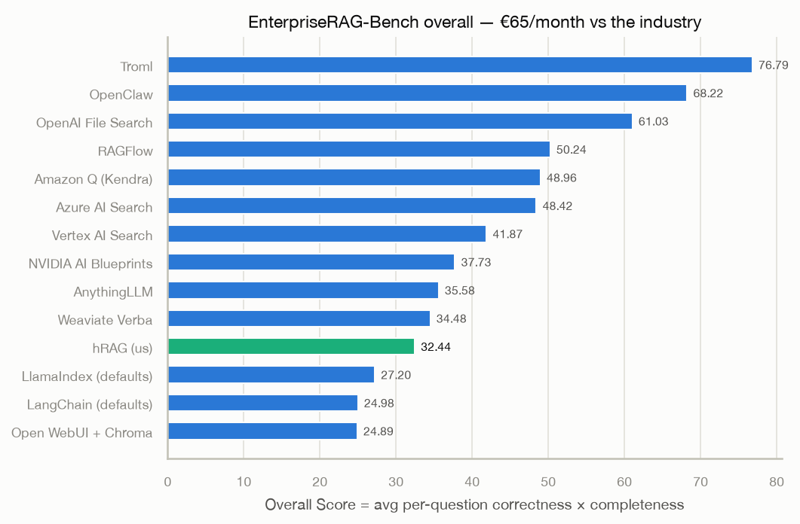
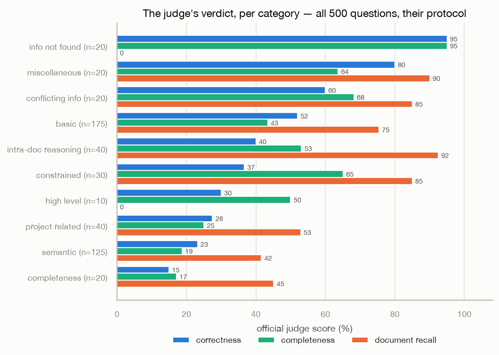

# Session 4.1 — generation, and the official judge's verdict

2026-08-04→05. The platform grew a mouth (`/chat`: retrieval at the
measured winners → LLM synthesis → SSE stream with numbered citations),
answered all 500 EnterpriseRAG-Bench questions through its own pipeline,
and was graded by the benchmark's own harness — their judge (gpt-5.4),
their protocol, their gold-set-correction consensus machinery.

## The generation layer

- `POST /chat`: hybrid retrieval (bm25 arm, vector weight 0.3, top-8
  chunks) → provider-agnostic LLM client (OpenAI-compatible dialect +
  Anthropic dialect, raw REST/SSE, no SDKs) → `sources` event, `delta`
  stream, `done` with timings. `stream=false` for plain JSON.
- Guardrails as features: **grounding floor** (empty retrieval →
  server-side refusal, zero LLM tokens), injection-resistant system
  prompt (context is data, not instructions), per-request model behind
  an allowlist, `usage_daily` (RLS'd, migration 0006) with per-tenant
  daily token budgets → 429.
- Answering model: `mistralai/mistral-small-3.2-24b-instruct` via
  OpenRouter. Generating all 500 answers: ~30 min, **~$0.20**.

## The official numbers (all 500, their judge)

| column | official | our set-math | leaderboard placement |
|---|---|---|---|
| Document Recall | **66.32** | 66.19 | **6th of 14** |
| Correctness | **42.2** | — | ~10th |
| Completeness | **40.8** | — | ~9th |
| **Overall** | **32.44** | — | **11th of 14** |
| Invalid extras | 9.04 | ~9 | reranker's job |



Their Overall Score is the per-question **product** of correctness ×
completeness, averaged (formula verified by reproducing all 13 published
leaderboard rows). Document recall is not part of Overall: **the
leaderboard is an answer-quality ranking fed by retrieval.** Above every
framework default (LlamaIndex 27.2, LangChain 25.0, OpenWebUI 24.9),
below the managed products; the judge applied 19 gold-set corrections
and still confirmed our self-measured recall to **0.13 points** — the
part-1 measurement methodology is externally validated.



Three stories in the per-category table:

1. **`info_not_found`: 95% correct — the grounding floor's report
   card.** Built as a jailbreak defense (empty retrieval → refusal), it
   turns out to be a benchmark superpower: most systems hallucinate an
   answer where none exists; ours says "I could not find that in the
   documents" and the judge rewards exactly that.
2. **The synthesis gap, quantified**: intra-document reasoning scores
   **92.5 recall / 40.0 correctness** — we hand the model the right
   document and it fails to stitch an answer from its distant sections.
   Same shape on the completeness category (45.1 recall / 15.0 correct).
   Retrieval is no longer the bottleneck; answer synthesis with a terse
   24B model is.
3. **Semantic stays the embedder's bill**: 23.2% correct on 41.6%
   recall — the 384-dim ceiling from part 1, now with an answer-quality
   price tag.

## The ops story (for the article)

- Their harness hardcodes the OpenAI client — but the openai SDK reads
  `OPENAI_BASE_URL` from the environment and their `LLM_MODEL_NAME`
  override exists, so OpenRouter can drive their judge **with their
  default judge model** (gpt-5.4). Same protocol, one footnote.
- Economics: answers $0.20, judging ~$12–15. The judge died at question
  335 with `402: you requested 65536 tokens but can only afford 39992`
  — the benchmark's final boss was the OpenRouter credit balance. Top
  up, `--resume`, done.
- Answer generation runs outside the user-facing `/chat` budget (the
  batch synthesizes via the platform's own `llm.py`); the per-tenant
  token budget would have 429'd the run at question ~45 — the guardrail
  guarding us from ourselves.

## Next: the answering-model ladder (4.2)

The multiplicative Overall means paired gains in correctness and
completeness compound: ~41/~41 → ~55/~55 roughly doubles Overall into
the managed-cloud pack, with retrieval already in place. A stratified
100-question slice (baseline scores within 1.2pt of the full run:
39.0/39.2/31.35 vs 42.2/40.8/32.44) is being re-answered along four
rungs — gpt-5-mini, claude-haiku-4.5, mistral-small with a
completeness-oriented prompt, mistral-small with 16 chunks — and judged
identically. One variable per rung. Results in `results/erb-ladder-*`.

Reproduce:

```bash
uv run --with httpx python bench/answer_bench.py \
    --questions ../EnterpriseRAG-Bench/questions.jsonl \
    --api-url https://rag-api.<tailnet>.ts.net --tenant erb-v1 \
    --state bench/state-erb-v1.jsonl --answers bench/answers-official.jsonl
# judge (from the bench repo; OpenRouter drives their default judge model)
LLM_PROVIDER=openai LLM_API_KEY=$OPENROUTER_KEY \
OPENAI_BASE_URL=https://openrouter.ai/api/v1 LLM_MODEL_NAME=openai/gpt-5.4 \
python -m src.scripts.answer_evaluation.metrics_based_eval \
    --answers-file ../rag-api/bench/answers-official.jsonl --resume
```
