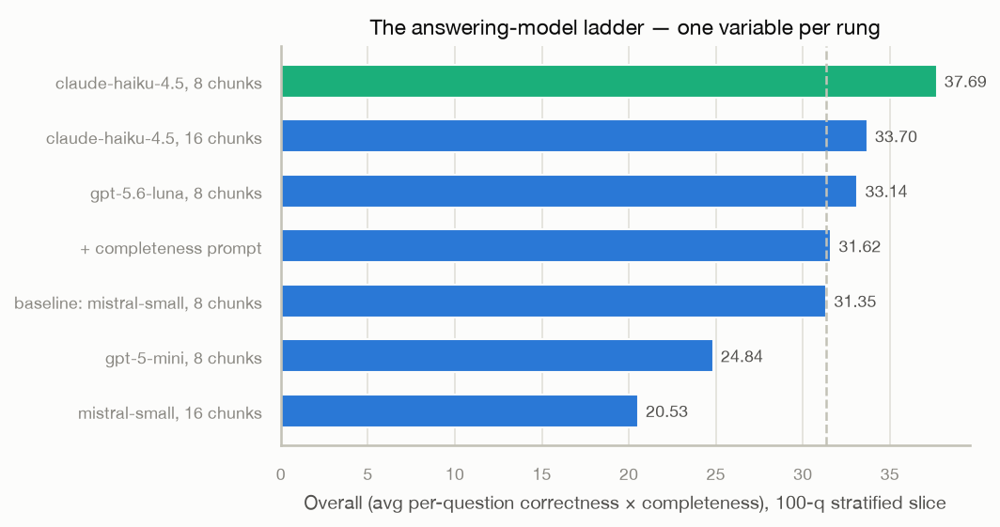

# Session 4.2 — the answering-model ladder

2026-08-05. The judge said retrieval is 6th and answers are 11th, and
that Overall = correctness × completeness per question — so the biggest
lever is the answering side. A stratified 100-question slice (baseline
scores within ~1pt of the full run) re-answered one variable at a time,
each rung judged identically (gpt-5.4, their protocol).

| rung | correct | complete | **overall** | recall |
|---|---|---|---|---|
| **claude-haiku-4.5, k8** | 44.0 | 44.9 | **37.69** | 61.1 |
| claude-haiku-4.5, k16 | 36.0 | 45.8 | 33.70 | 60.7 |
| gpt-5.6-luna, k8 | **48.5** | 42.2 | 33.14 | 61.2 |
| + completeness prompt (mistral) | 37.0 | 40.6 | 31.62 | 60.9 |
| baseline: mistral-small-3.2, k8 | 39.0 | 39.2 | 31.35 | 60.7 |
| gpt-5-mini, k8 | 36.0 | 30.9 | 24.84 | 60.7 |
| mistral-small-3.2, k16 | 25.0 | 25.7 | 20.53 | 60.6 |

(Recall barely moves across rungs — same retrieval underneath; it is the
answering column being measured. Ladder cost: ~$20, of which ~95% was
the gpt-5.4 judging.)

## Findings

1. **Winner: claude-haiku-4.5 at 8 chunks** — +6.3 overall (+20%) over
   the mistral baseline, balanced across both multiplicands. Now the
   platform default (`LLM_MODEL=anthropic/claude-haiku-4.5`).
   Extrapolated to the full 500: roughly 32.4 → ~39 overall, past
   NVIDIA AI Blueprints (37.7), approaching Vertex (41.9).
2. **More context is an anti-lever, for everyone.** mistral at 16
   chunks collapsed (31.4 → 20.5: it drowns, over-refusing with "not in
   the documents" while the answer sits in its window). The stronger
   reader ALSO lost correctness at k16 (44 → 36) even as completeness
   rose — extra chunks act as distractors, not just noise. Two models,
   one verdict: at this chunk size, k=8 is the sweet spot, and the fix
   for multi-doc questions is better SELECTION (reranker), not a wider
   shovel.
3. **Prompt engineering without material is free and worthless**: the
   "state every fact" suffix moved mistral +0.27. A clean negative.
4. **gpt-5.6-luna: sharpest correctness anywhere (48.5), terse to a
   fault** (42.2 completeness). Also the source of a trap worth
   documenting: gpt-5-family models spend `max_tokens` on hidden
   reasoning FIRST — at 1024 max_tokens, 27% of gpt-5-mini's answers
   came back as empty strings. Raise max_tokens for reasoning families
   or measure nothing.
5. gpt-5-mini, even after the fix: 24.84. Not its benchmark.

## Method notes

- One variable per rung against a fixed baseline; same retrieval, same
  judge, same slice. The slice's baseline tracked the full-500 run
  within ~1pt on every column, so slice deltas are trustworthy.
- Judges run with `--resume` after the second credit-exhaustion incident
  (402 mid-run): already-scored questions must never be re-billed.
- Judge model stays gpt-5.4 (their default) even when cheaper strong
  models exist: comparability to the published leaderboard rows IS the
  product of these runs.

## Next

- Optional rung with upside: luna × completeness-prompt (48.5-correct ×
  lifted completeness could clear 40) — ~$3.70 if wanted.
- The submission run: full 500 at haiku-k8, judged once (~$15), then
  the leaderboard submission with repro guide.
- Reranker (4.3): now doubly motivated — it attacks both the
  invalid-extras (9.04) and the k16 finding's real lesson (better
  selection beats more context).

## Addendum — the submission run and the judge calibration (4.2b)

Judging moved to gpt-5.6-luna after the cost reality of gpt-5.4 (~95% of
all spend) became a dashboard scream. Calibration first: the haiku rung
judged by BOTH — gpt-5.4: 37.69, luna: 37.32. **Judge agreement within
0.4 points**; the cheap judge measures the same thing, ~40× cheaper.
Winner pick re-confirmed same-judge (haiku 37.32 vs luna-complete
34.96), then the full 500 at haiku-k8:

| | full 500, haiku-k8 (luna-judged) | full 500, mistral (gpt-5.4-judged) |
|---|---|---|
| Correctness | **42.8** | 42.2 |
| Completeness | **48.9** | 40.8 |
| Overall | **38.22** | 32.44 |
| Document Recall | 66.37 | 66.32 |
| Invalid extras | 9.02 | 9.04 |

Overall placement: **8th of 14** (past NVIDIA 37.73), recall still 6th.
The retrieval columns are judge-invariant to within noise across four
independent judge runs — the platform's measurement stack is stable.
Submission artifact: `bench/answers-submission.jsonl`.
